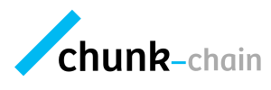

	

Chunkchain is a free and open-source blockchain simulation tool. It is designed to support any lectures in lower and higher education related to blockchain or distributed ledger technology. Since hands-on learning experiences are crucial for developed a more in-depth understanding, this tool showcases the technology of distributed ledgers in a varity of use cases.

Its objectives are:

* see some use cases how blockchain works
* easy simple exchange of protocols or the methods
* get a profound understanding what happens in the background
* see opportunities and potentials to start working on own idea

## Use Cases

### Use Case #1: The Chat Platform

The chat platform based on a distributed P2P network enables getting more understanding of the different layers of blockchain. By enabling single 1:1 chats with messages, in the background, it shall be possible to see how transaction speed relies on the selected consensus mechanism and how you can buy yourself your messages.

* Type of blockchain: Public blockchain
* Consensus mechanism: Proof-of-Work

### Use Case #2: The Online Store

We all know famous retailers like Amazon. But with blockchain technologies, it was always promised the intermediate isn't necessary anymore. But is it true? The online store is a setup where some participants will be randomly either manufacturer or purchaser.

* Type of blockchain: Public blockchain
* Consensus mechanism: Proof-of-Stake

### Use Case #3: Gameshow

This game show is fun, as the participants are randomly assigned to single rounds where they must answer a question. However, the game relies on the trust of the network in this gameshow as they vote, who they believe more. The winning vote decides who's answers adds to the blockchain.

* Type of blockchain: Public blockchain
* Consensus mechanism: Proof-of-Vote
